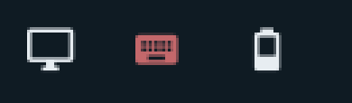
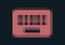

# Omarchy Keylight

A keyboard backlight bar widget for [Omarchy](https://omarchy.org/).

Adds a keyboard-pill to the bar for controlling your laptop keyboard backlight. Left click cycles the brightness up (0 → 1 → … → max → 0); right click cycles it down. A push notification (OSD) shows the new brightness level after each step.

The built-in LED driver reports brightness as 0 even when lit, so the widget can't read the real level back from hardware. Instead it keeps its own last-known level in a file under `XDG_STATE_HOME` and refreshes it on every change — the persisted level survives shell reloads and reboots. The true maximum is probed at load time with `brightnessctl max`, so the cycle covers the full range your keyboard supports. Because many laptops boot with the keyboard backlight off, the persisted level is re-applied automatically when the shell loads.

## Screenshot

The active pill as it appears in the bar, next to the power button:



Zoomed in:



## Install

Requires an **Omarchy** system (Hyprland + the Omarchy shell), plus:

- **`brightnessctl`** — for setting the LED brightness. Install it with `sudo pamac install brightnessctl` or the equivalent for your package manager.
- A **keyboard backlight** exposed as an LEDs-class device named **`asus::kbd_backlight`** (used by ASUS `asus-nb-wmi`). Find your device name with `brightnessctl -l`.
- `omarchy-osd` for the brightness notification (ships with Omarchy).

```sh
omarchy plugin add https://github.com/Gnosis80s/OmarchyKeylight.git --enable
```

The command clones the repo, validates it against the Omarchy plugin schema, installs it to `~/.config/omarchy/plugins/gnosis.kbd-backlight/`, and enables it in the bar. The bar hot-reloads; no shell restart is needed.

Not in the position you want? Move it:

```sh
omarchy bar move gnosis.kbd-backlight --section right
```

Or enable it manually if it wasn't added to the bar:

```sh
omarchy plugin enable gnosis.kbd-backlight
```

## Usage

- **Left click** on the pill: increase keyboard backlight one step.
- **Right click**: decrease keyboard backlight one step.

## Notes

- The LED device is hardcoded to `asus::kbd_backlight` in `BarWidget.qml`; laptops from other vendors expose a differently named device. Edit the `device` property to match yours (find it with `brightnessctl -l`).
- Requires `brightnessctl` and a writable `$XDG_STATE_HOME` (defaults to `~/.local/state`); the level is persisted to `~/.local/state/gnosis-kbd-backlight`.
- The pill icon uses a Nerd Font glyph; it renders with the standard Omarchy bar font.

## Layout

```
gnosis.kbd-backlight/
├── manifest.json     # Plugin manifest (id, entry point, bar-widget metadata)
└── BarWidget.qml     # Bar pill: keyboard icon, left/right click cycling
```